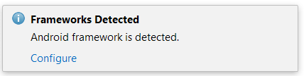
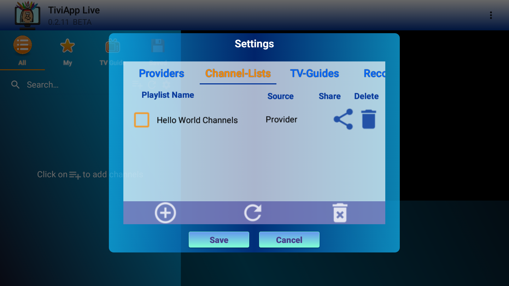
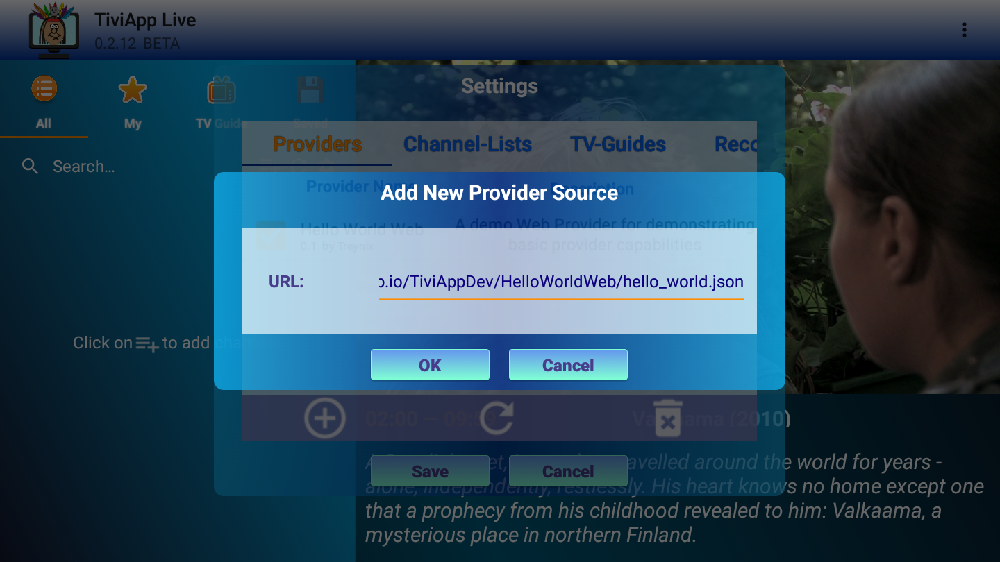
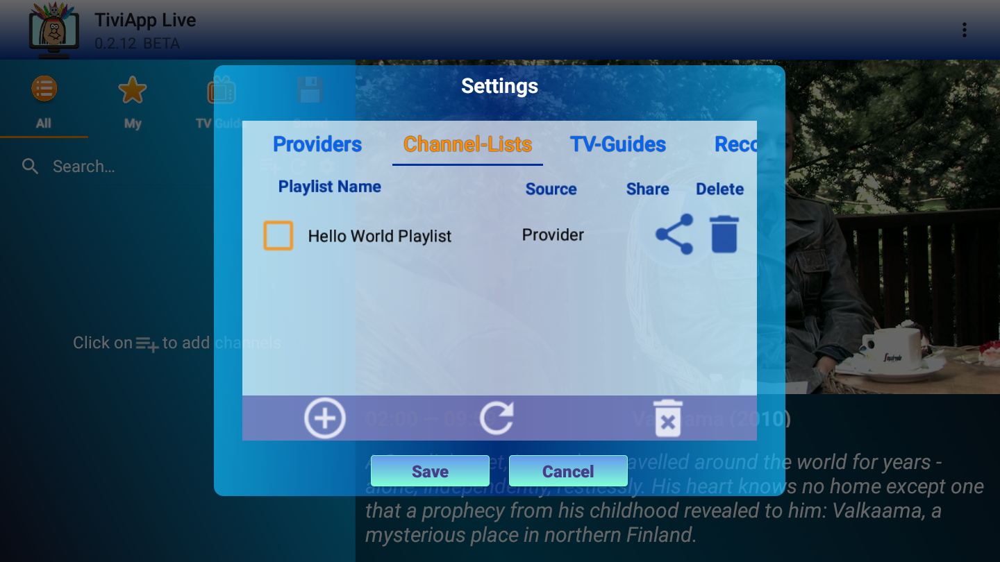

# Welcome Developers and Content Owners!

This GitHub page contains all the information you need for creating and managing your own TiviApp Content Provider. 
Here you will find:
- An introduction to the Content Provider concept
- A quick guide on how to get started with developing your own Content Provider
- "Hello World" projects overview
- A guide on how to upload your working Provider to our main repository
 
 If you are still not fimiliar with the TiviApp application, please visit our [website](http://tiviapplive.com).
 
## Introduction
 
 A Content Provider is basically a third-party piece of code (sometimes called "plugin" or "addon") that can provide usefull content for TiviApp users. This content can be either:
 - One or more playlists (**Channel Lists**) in _M3U_ format
 - One or more EPG (**TV Guides**) in _XMLTV_ format
 - A playable video/audio stream (**Channel**) in one of the supported formats 

 
 There are two types of Providers that are currently supported by TiviApp:
 * **Android Provider**: A Provider that comes in a form of an Android application. This kind of provider is demonstrated by the ["HelloWorld"](HelloWorld) Android Studio project in this repository
 * **Web Provider**: A Provider that comes in a form of a web application. This kind of provider is demonstrated by the ["HelloWorldWeb"](HelloWorldWeb) web project.
 
 A Provider can be also viewed as a small _server_ that handles various requests from the TiviApp client. Therefore your code should be designed and developed according to the following basic principles:
 * **Efficiency**. Upon receiving a request from the client, the server should provide a response as quickly as possible. If your code is unbale to send a response to the client within a reasonable amount of time - a timeout will be invoked and your content will be ignored by TiviApp.
 * **Memoryless**. Your code should respond only to the given request. There is no need to store or rely on data from previous requests as it most likely irrelevant.
 * **Responsive**. You should provide a response to any request from the client, even if an error has been found during the execution of your logic. TiviApp Provider Platform has APIs for reporting errors to the client. Some of them will be displayed to the user.
 * **Compact** (for Android Provider). Avoid allocating memory on the heap and free it all upon receiving the ```onDestroy``` event.

## Getting Started

 The simpliest way of getting started is to clone this repository and start exploring the demo projects. The following sections will guide you through the neccessary steps for getting the "Hello World" projects up and running on your machine. So use your favorite Git client to cone this repository at: ```https://github.com/montezumba/TiviAppDev.git``` and let's get started!
 
### Android Provider
 
 This type of provider is the most powerfull option and is best suited for Android Developers who wish to add some non-trivial logic that should be executed on a native environment. For this, you will need to have some knowledge of developing Android applications and the following environment set up:
 - Android Studio 3.1.3 or above.
 - Android SDK support for API 27. 
 - An Android device running Android 4.2 or higher
 
 After clonning the repository (for example to: C:\TiviAppDev), just follow these steps:
 1. Open Android Studio and select "_Open an existing Android Project_"
 2. Select the HelloWorld project at C:\TiviAppDev\HelloWorld
 3. If a message appears that request further configuration, click on "_Configure_"
 
 4. Build the project and run on your Android device.
 5. This project has no default Activity, so you shouldn't see anything running after clicking on "_Run_"
 6. Open TiviApp, choose "_Settings_" and select the "_Providers_" tab. You should see the following new Provider in that list:
 
 
 
 Each Content Provider is hosted on a repository (server for example), which is described by a special _JSON_ file. TiviApp has one such repository embedded within the main application - the _Official TiviApp Repository_. If your Provider is not hosted there, the user should explicitly add your repository by providing the path to the corresponding JSON. (see below)

### Web Provider
 This type of provider is suited for quick and simple content providers (usually ones that already have a website or an IPTV server running). To setup a Web Provider you will need some basic knowledge in web development, specifically in javascript. 
 A typical Web Provider consists of the following two files:
 1. A _Virtual Repo_ file (see below for more details). This file will usually have the _*.json_ extenssion (or _php/aspx_ for server-generated repos) and point to one or more _Web Provider files_    
 2. A _Web Provider_ file (usually with _html/js/php/aspx_ extenssion) that holds the server logic and retrieves playlists/EPG.
 
 In the ["HelloWorldWeb"](HelloWorldWeb) prohect we have prepared three demo files to illustrate each type and how they are connected with one another:
 1. [Virtual Repo File](HelloWorldWeb/hello_world.json) that can be accessed globally at: https://montezumba.github.io/TiviAppDev/HelloWorldWeb/hello_world.json
 2. [Web Provider File](HelloWorldWeb/hello_world.html) that can be accessed globally at: https://montezumba.github.io/TiviAppDev/HelloWorldWeb/hello_world.html
 3. [A demo playlist file](HelloWorldWeb/hello_world.m3u) that can be accessed globally at: https://montezumba.github.io/TiviAppDev/HelloWorldWeb/hello_world.m3u
 
 To add this provider to TiviApp, just follow these simple steps:
 1. Open TiviApp and go to "_Settings_"
 2. Select the "_Providers_" tab
 3. CLick on the "_+_" button to add a new Provider
 4. Enter the URL for the _Virtual Repo_ file (see above) and click "_OK_".
  The Provider info, playlist(s) and TV Guide(s) should appear in the corresponding tabs:
 
 
 
## Development

 In this section we will provide an overview the basic concepts of Provider Development. We assume here that you already cloned this repo and you know how to build and run the corresponding demo projects.
 
### Android Provider

If we explore the demo project we can see the observe the following source files:
* [HelloWorldConfig.java](HelloWorld/HelloWorldProvider/src/main/java/com/treynix/helloworld/HelloWorldConfig.java): This class holds all the required configuration of this provider.
* [HelloWorldMain.java](HelloWorld/HelloWorldProvider/src/main/java/com/treynix/helloworld/HelloWorldMain.java): This class is the entry point for the server. The developer should override the basic callbacks for handling TiviApp requests and other various server events.
* [HelloWorldService.java](HelloWorld/HelloWorldProvider/src/main/java/com/treynix/helloworld/HelloWorldService.java): Registers the specific _Config_ and the _Main_ classes above to the TiviApp Providers framework.
* [HelloWorldApplication.java](HelloWorld/HelloWorldProvider/src/main/java/com/treynix/helloworld/HelloWorldService.java): This class implements the required _MultiDex_ support (required by some of the dependicies).

The [AndroidManifest.xml](HelloWorld/HelloWorldProvider/src/main/AndroidManifest.xml) configuration files should be configured as follows:
* Provide the necessary permissions for providing the content. Usually these are required for most typical providers:

```
 <uses-permission android:name="android.permission.INTERNET" />
 <uses-permission android:name="android.permission.WRITE_EXTERNAL_STORAGE" />
``` 
 
* Declare your _Application_ class:

```
android:name="HelloWorldApplication"
```

* Declare your _Service_ class:

``` 
<service android:name="HelloWorldService" >
```

* Provide the following intent filter:

```
    <intent-filter>
        <action android:name="com.treynix.helloworld.ACTION_ADDON_REQUEST" />
        <action android:name="com.treynix.tiviapp.action.ACTION_PROVIDER_REGISTER" />
        <action android:name="com.treynix.tiviapp.action.ACTION_PROVIDER_KILL" />
    </intent-filter>
```

* Provide the following meta data tags, based on the supported features (request types) of your provider:

```
    <meta-data android:name="playlist_support" android:value="true"/>
    <meta-data android:name="tvguide_support" android:value="true"/>
    <meta-data android:name="video_support" android:value="true"/>        

```

In the [HelloWorldConfig.java](HelloWorld/HelloWorldProvider/src/main/java/com/treynix/helloworld/HelloWorldConfig.java) you should provide the basic configuration to your provider, based on the following base-constructor arguments:

```
public HelloWorldConfig() {
		super(	"Hello World Provider",
				5 * Constants.MINUTES,
				5 * Constants.MINUTES,
				10,
				HelloWorldConfig.class.getPackage().getName(),
                null
                );
	}
```

* _Provider Name_: this text will appear in the _Providers_ settings menu
* _Maximal Execution Time_: sets the maximum allowed time for a single request to be processed.

**WARNING: Setting too high values is not recommended. TiviApp has its own timeout mechanism, which will deactivate non-responsive providers. Each provider should detect and handle its own timeouts and errors.**

* _Connection Timeout_: sets the maximum allowed time for the server to respond to incomming requests
* _Requests Limit_: sets the maximal number of requests that this server can handle simultaniously
* _Provider Unique Identifier: a unique string that will identify this provider. It is recommended to use the _Package Name_ of the server application for this field
* _Repository Url_: provides a URL to a repository server (optional)

The [HelloWorldMain.java](HelloWorld/HelloWorldProvider/src/main/java/com/treynix/helloworld/HelloWorldMain.java) handles the main server logic by implementing the following interface methods:

* _onInit_ : handles the initialization event. In this method you should implement all the "heavy" logic for preparing and setting the data required for handling future requests.

* _onStart_ : handles the actual requests. Each new request will trigger this callback, so use the `Worker` utility to handle requests asynchroniously.

* _onCancel_ : handles the case when the TiviApp client requests to cancel a previously sent request. It is important to use this callback in order to avoud sending irrelevant or outdated data.

* _onDestroy_ : used to clean-up resources (when needed) and to wrap things up. 

**WARNING: All these methods are blocking. Remember: you are implementing a server and the best practice here is to avoid "heavy" logic. However, if you do need perform some blocking operations - use the `Worker` utility to allow parallel execution.**

### Web Provider

 In this section we will provide an overview the basic concepts of Provider Development. We assume here that you already cloned this repo and you know how to build and run the corresponding demo projects.
 
## Welcome to GitHub Pages

You can use the [editor on GitHub](https://github.com/montezumba/TiviAppDev/edit/master/README.md) to maintain and preview the content for your website in Markdown files.

Whenever you commit to this repository, GitHub Pages will run [Jekyll](https://jekyllrb.com/) to rebuild the pages in your site, from the content in your Markdown files.

### Markdown

Markdown is a lightweight and easy-to-use syntax for styling your writing. It includes conventions for

```markdown
Syntax highlighted code block

# Header 1
## Header 2
### Header 3

- Bulleted
- List

1. Numbered
2. List

**Bold** and _Italic_ and `Code` text

[Link](url) and 
```

For more details see [GitHub Flavored Markdown](https://guides.github.com/features/mastering-markdown/).

### Jekyll Themes

Your Pages site will use the layout and styles from the Jekyll theme you have selected in your [repository settings](https://github.com/montezumba/TiviAppDev/settings). The name of this theme is saved in the Jekyll `_config.yml` configuration file.

### Support or Contact

Having trouble with Pages? Check out our [documentation](https://help.github.com/categories/github-pages-basics/) or [contact support](https://github.com/contact) and we’ll help you sort it out.
